# Setting up the game in Roblox Studio

The map, cars, lighting and every GUI are built **in Studio as real objects** you can see,
move and restyle. The scripts only add behaviour. Here's the whole setup, start to finish.

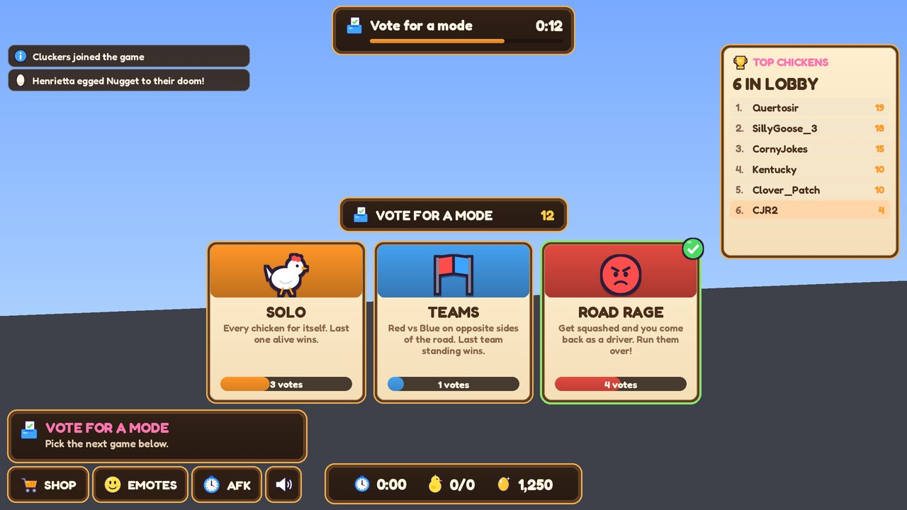

## 1. Sync the code (Rojo)

1. Open the project folder in VS Code (the folder with `default.project.json` in it).
2. Start Rojo: VS Code extension **Rojo: Open menu → default.project.json**, or run `rojo serve`.
3. In Studio: **New → Baseplate**, then **Plugins → Rojo → Connect**.

You should now see `ReplicatedStorage > Shared`, `ReplicatedStorage > Builders`,
`ServerScriptService > Server` and `StarterPlayer > StarterPlayerScripts > Client`.

## 2. Build the world and GUI (one command)

1. Make sure you're in **Edit mode** (not playing).
2. Open **View → Command Bar**.
3. Paste this line and press Enter:

```lua
local b=game.ReplicatedStorage.Builders:Clone() b.Parent=game.ServerStorage local ok,e=pcall(require(b.BuildAll)) b:Destroy() print(ok and "Built!" or e)
```

The Output window prints what it built. You now have:

| Where | What |
|---|---|
| `Workspace > Arena` | two 4-lane roads, the grass median with sprinklers, the BARN and WINDMILL sidewalks, tunnels, farm islands, clouds |
| `Workspace > Lobby` | the chicken-coop lobby with the spawn nest, golden egg statue, how-to-play board |
| `ReplicatedStorage > Assets > Cars` | the traffic, the Road Rage car and the median harvester |
| `ReplicatedStorage > Assets > Chickens` | the cartoon chicken character, one per skin (players spawn as these) |
| `Lighting` | warm late-afternoon sun, haze, bloom, colour grading, sun rays, soft far blur, clouds |
| `StarterGui > Hud, Shop, Emotes, Driver` | every screen of the barnyard-themed UI |

Until you do step 3, the chicken, cars and props are made of parts. After step 3 they're
the smooth Blender models.

It also deletes the Baseplate and the default SpawnLocation (chickens must be able to fall,
and everyone spawns in the lobby). **Ctrl+Z** undoes the whole build.

**Save the place** (File → Save to File / Publish) so the build is kept.

### Editing what was built

- **Safe to change freely:** anything in `Arena > Decor` and `Lobby > Decor` (move, recolour,
  delete, add your own builds), car models, lighting, and the *look* of every GUI element
  (colours, fonts, sizes, positions, strokes, gradients).
- **Keep the names** of GUI elements and of these gameplay pieces, because scripts look them up:
  `Arena > Road`, `Arena > Sidewalks` (tiles keep their `Side`/`Row` attributes),
  `Arena > Walls`, `Lobby > LobbySpawn`, and everything inside the ScreenGuis.
- **Chickens:** recolour or reshape freely, add hats or accessories (weld them to `Head` or
  `Body`). Keep `HumanoidRootPart`, the `Humanoid`, and the joints (`Root`, `Neck`, `LeftWing`,
  `RightWing`, `LeftHip`, `RightHip`, `Tail`) since the animation drives those. `LidL`/`LidR`
  are the blinking eyelids.
- **To rebuild something from scratch**, delete it and run the command again. It only builds
  what's missing, so the rest of your edits are kept.
- If you forget to build, the game still runs: it builds a temporary copy at runtime and warns
  in the Output window.
- **GUI updates:** when a new version of the game changes the GUI design, running the command
  replaces the old ScreenGuis and moves them to `ServerStorage > OldGui` (so customisations
  aren't lost). Delete that folder when you don't need it. If you forget, the game builds the
  new GUI at runtime and warns in Output.
- **GUI layout:** every screen is designed in pixels for a 1280x720 screen inside its `Root`
  frame, and the game scales `Root` to fit each device (a bit bigger on phones, where the
  objective card moves to the top and the buttons to the left so the thumbstick has room).
  Sizes and positions you set in Studio are in those 1280x720 pixels.

## 3. Import the 3D models (smooth chicken, cars, props)

> **Updating from an earlier version?** The chicken model changed. In
> `ReplicatedStorage > Assets > Meshes`, delete the old **Chicken** model, import the new
> `Chicken.glb` (or `Chicken.fbx`) and run the build command; the chickens rebuild themselves.
> Until you do, Output says the chicken meshes don't match and the part-built chicken is used.

The smooth chicken, the cars and the farm props were modelled in Blender (`tools/blender`) and
exported as three files:

| File | What's in it |
|---|---|
| `assets/models/Chicken.glb` | the chicken, split into colour regions so every skin can recolour it |
| `assets/models/Vehicles.glb` | sedan, hatchback, sports car, pickup, van, ice-cream van, tractor, taxi, Road Rage car, harvester |
| `assets/models/Props.glb` | trees, bushes, rocks, flowers, grass, hay, fences, barn, silo, windmill, farmhouse, lamp, clouds, island, corn, pumpkins, nest... |

1. **File → Import 3D** (or the **Import 3D** button on the Home/Avatar tab) and pick
   `Chicken.glb`. In the import window keep the defaults; just make sure **Merge Meshes is off**
   (each piece must stay its own MeshPart). Click **Import**.
2. It appears in `Workspace` as a model full of MeshParts named like `Chicken__Body`.
3. In `ReplicatedStorage > Assets`, add a **Folder** named `Meshes` and drag the imported model
   into it.
4. Repeat for `Vehicles.glb` and `Props.glb` (into the same `Meshes` folder).
5. Delete `Workspace > Arena` and `Workspace > Lobby`, then run the build command again.
   Chickens and cars switch to the meshes automatically; the arena and lobby are rebuilt with
   the new trees, barns, windmills and so on.

Their size doesn't matter (the builders resize every piece from
`src/builders/MeshManifest.luau`), and names may get a suffix like `.001`. If something's off,
the Output window says which piece is missing or looks rotated, and that model falls back to
its part-built version. Every piece is under 3,000 triangles, so phones are fine.

## 4. Upload the art and sound (6 files)

The repo contains the UI art as **two images** and every sound effect as **one audio file**,
so there are only 6 uploads:

| File | Type | What it is |
|---|---|---|
| `assets/ui/UiSheet.png` | Image | all 39 icons + sunburst, glow, egg splat, patterns |
| `assets/ui/FarmSheet.png` | Image | the barnyard look: wood/hay textures, fence, ribbon, golden egg currency, farm icons |
| `assets/audio/Sfx.ogg` | Audio | all 40 sound effects back to back |
| `assets/audio/MusicLobby.ogg` | Audio | chill lobby music loop |
| `assets/audio/MusicRound.ogg` | Audio | energetic round music loop |
| `assets/audio/MusicSuddenDeath.ogg` | Audio | intense sudden-death loop |

1. Publish the place once (File → Publish to Roblox) if you haven't.
2. Open **View → Asset Manager**, click **Bulk Import**, and pick those files.
   (If your game belongs to a group, upload them to the group so the game can use them.)
3. When they finish (audio goes through a short moderation check), right-click each one in the
   Asset Manager → **Copy Asset ID**.
4. Paste each id into `src/shared/AssetIds.luau` in VS Code:

```lua
local ids = {
	UiSheet = 1234567890,
	FarmSheet = 1234567895,
	Sfx = 1234567891,
	MusicLobby = 1234567892,
	MusicRound = 1234567893,
	MusicSuddenDeath = 1234567894,
}
```

Rojo syncs it instantly. Until the ids are filled in, the UI shows emoji instead of the icons
(farm icons borrow the closest icon from `UiSheet` until `FarmSheet` is in) and the game is
silent, so everything still works while you wait.

### Sound not playing?

Press Play and look at the **Output** window: lines starting with `[Assets]` say whether each
file loaded. If one failed:

- **Just uploaded?** Audio is checked by Roblox moderation first. It can take from a few minutes
  to a few hours; the Asset Manager shows it as pending until then. Nothing to change, just test
  again later.
- **Wrong owner.** Audio only plays in experiences owned by the same account or group that
  uploaded it. If the game belongs to a group, upload the audio to the group (in the Asset
  Manager, switch the owner at the top before importing).
- **Not published.** Publish the place (File → Publish to Roblox) and test again.
- **Typo in the id.** Copy the id again with right-click → Copy Asset ID.

**Swapping any sound:** put a Sound named after the effect (e.g. `CarHorn`, `Bawk`,
`EggHit`; full list in `src/shared/SoundSprites.luau`) into `ReplicatedStorage > Assets > Sounds`
and it's used instead. Great for trying sounds from the Creator Store.

## 5. Play

Press **Play**. You'll spawn in the lobby nest, the lobby music plays, and voting starts.
For Teams / Road Rage / eggs hitting people use **Test → Clients and Servers** with 2+ players.

See `docs/TESTING.md` for the full checklist.

## Previews

These were rendered from the builder code itself (with `tools/preview`), so they show what you'll
get in Studio. Studio lighting (shadows, haze, bloom) makes it look better than these.

| | |
|---|---|
| 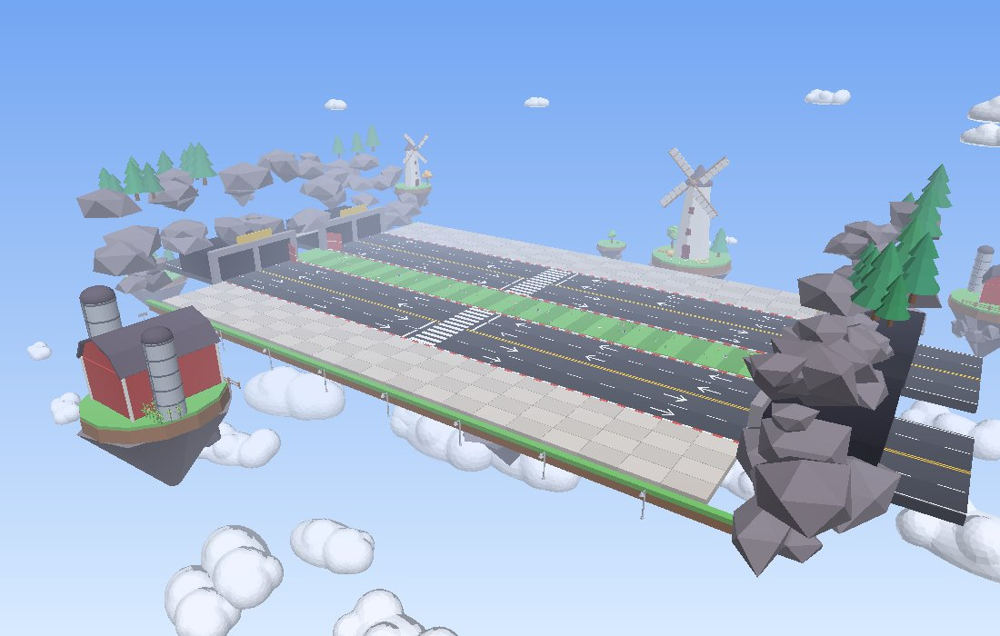 | 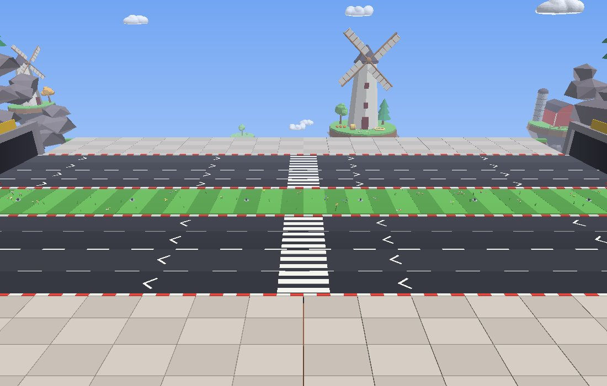 |
| 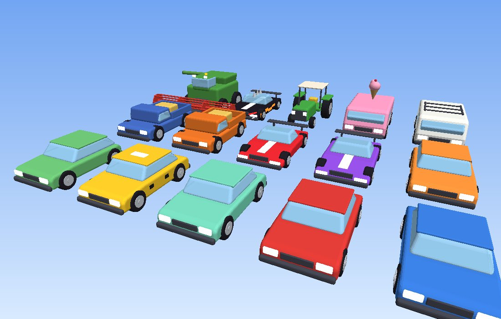 | 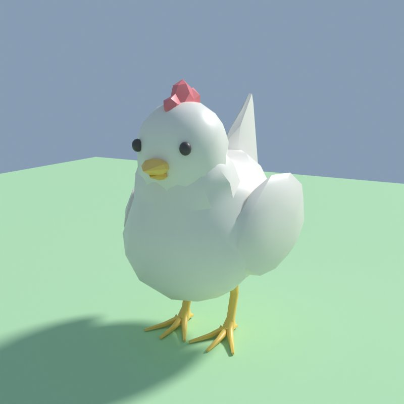 |
| 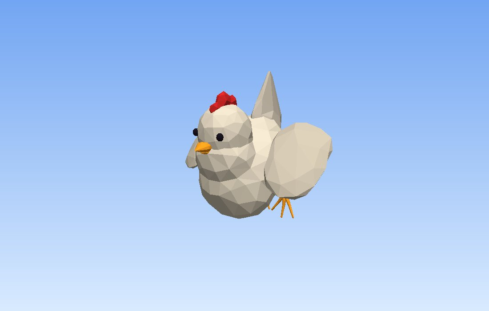 | 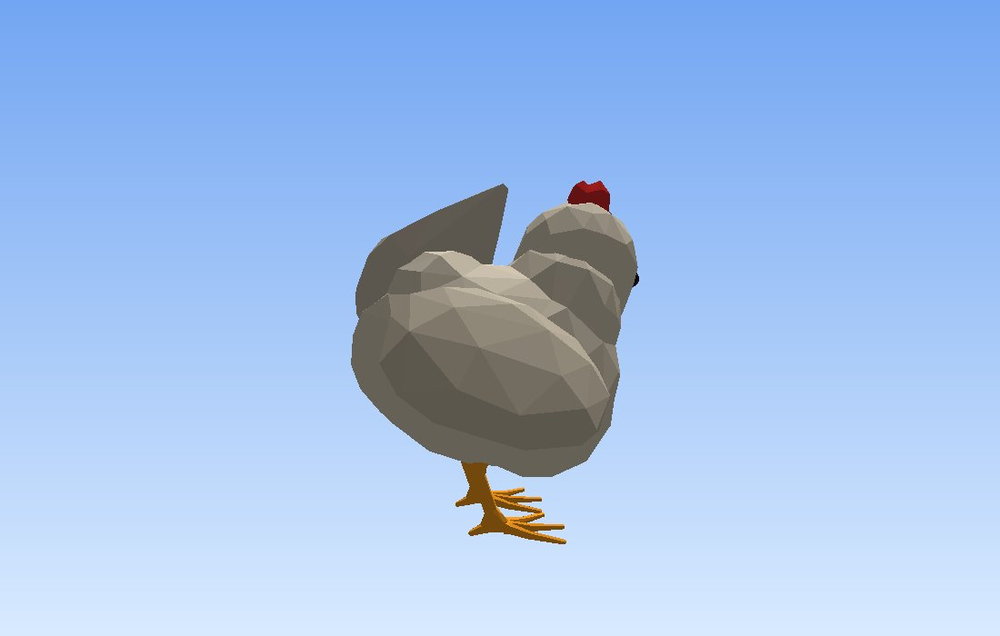 |
| 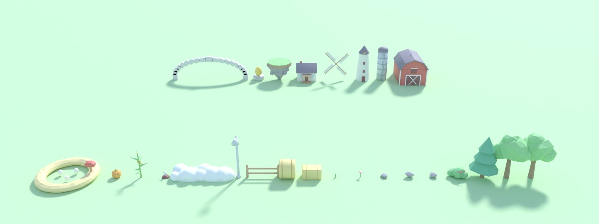 | 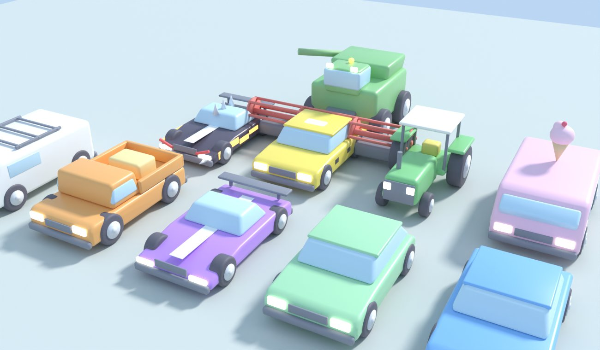 |
|  | 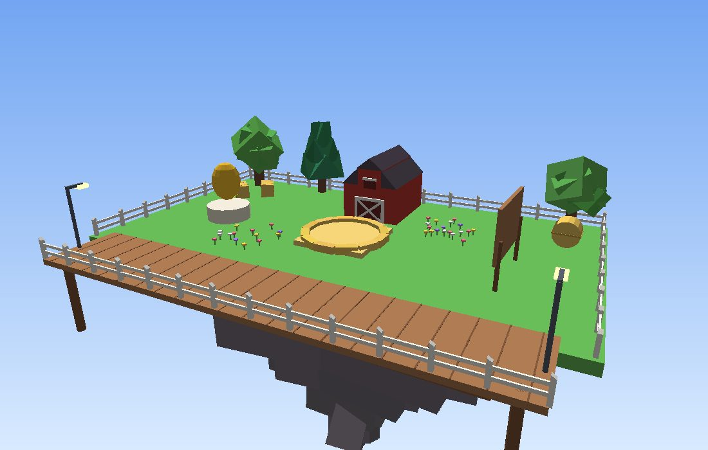 |
| 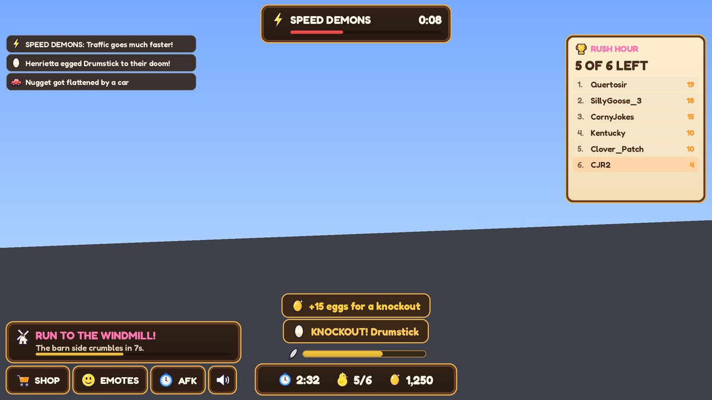 | 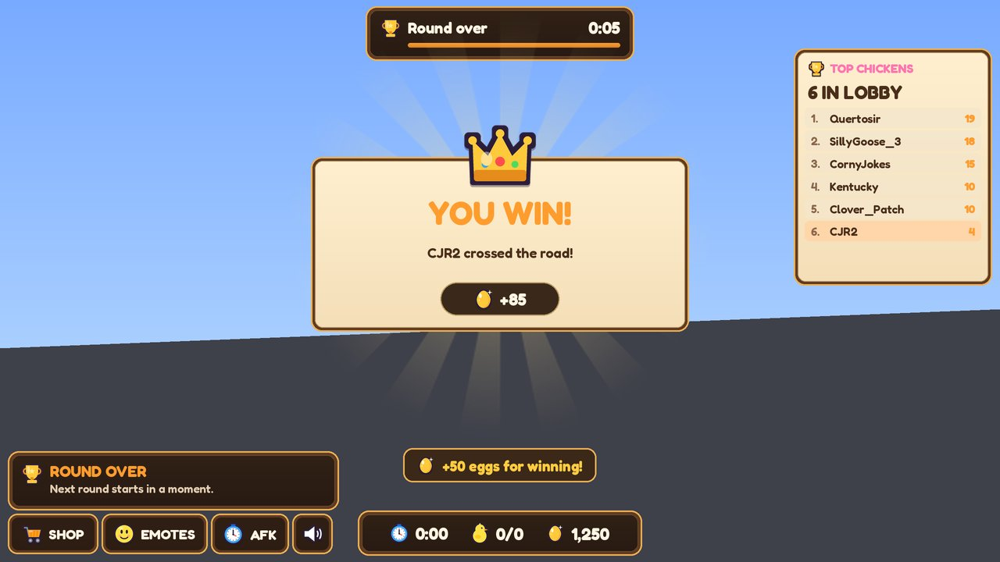 |
| 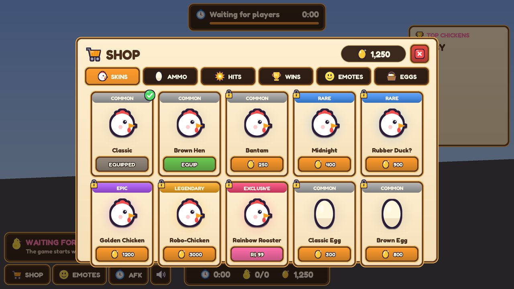 | 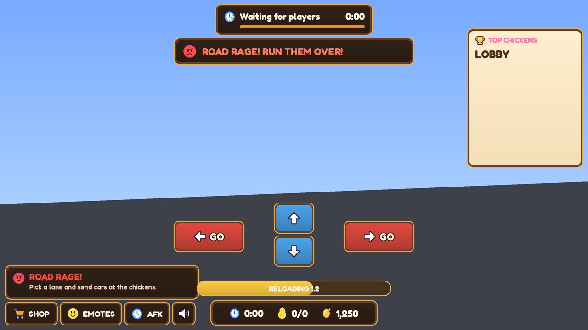 |
