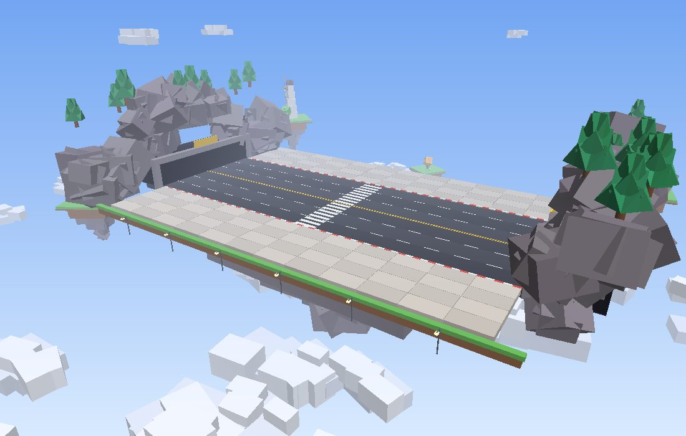
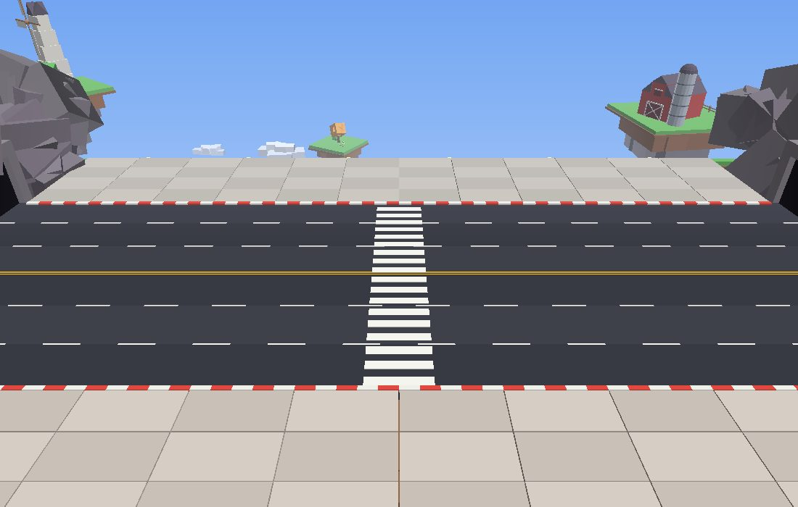
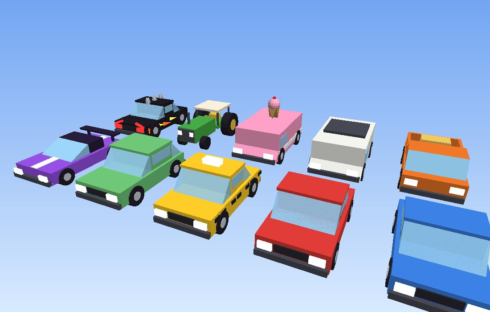
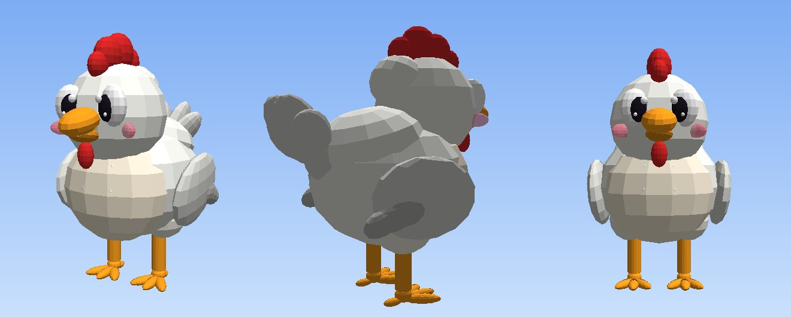
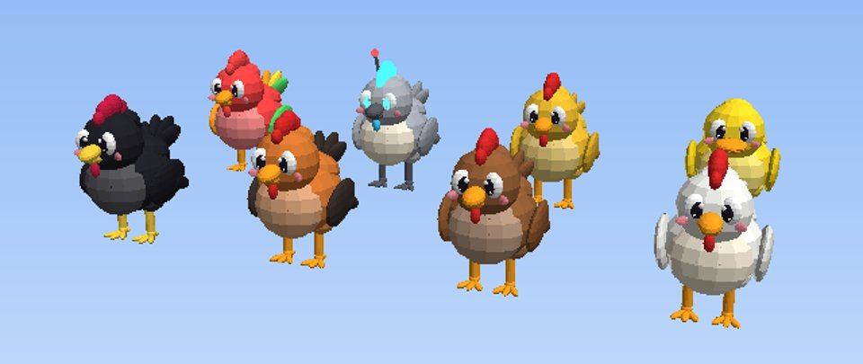
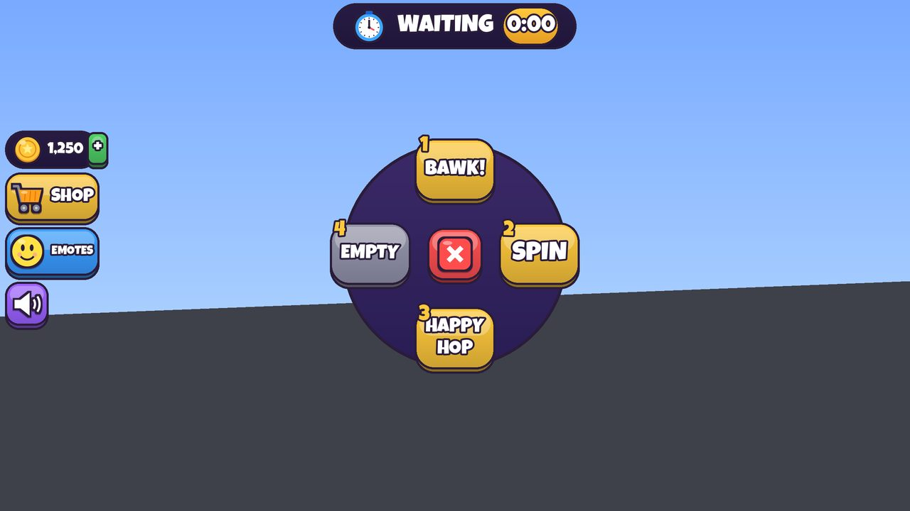

# Setting up the game in Roblox Studio

The map, cars, lighting and every GUI are built **in Studio as real objects** you can see,
move and restyle. The scripts only add behaviour. Here's the whole setup, start to finish.


## 1. Sync the code (Rojo)

1. Open the project folder in VS Code (the folder with `default.project.json` in it).
2. Start Rojo: VS Code extension **Rojo: Open menu → default.project.json**, or run `rojo serve`.
3. In Studio: **New → Baseplate**, then **Plugins → Rojo → Connect**.

You should now see `ReplicatedStorage > Shared`, `ReplicatedStorage > Builders`,
`ServerScriptService > Server` and `StarterPlayer > StarterPlayerScripts > Client`.

## 2. Build the world and GUI (one command)

1. Make sure you're in **Edit mode** (not playing).
2. Open **View → Command Bar**.
3. Paste this line and press Enter:

```lua
local b=game.ReplicatedStorage.Builders:Clone() b.Parent=game.ServerStorage local ok,e=pcall(require(b.BuildAll)) b:Destroy() print(ok and "Built!" or e)
```

The Output window prints what it built. You now have:

| Where | What |
|---|---|
| `Workspace > Arena` | the floating-island road, sidewalk tiles, tunnels, farm islands, clouds |
| `Workspace > Lobby` | the chicken-coop lobby with the spawn nest, golden egg statue, how-to-play board |
| `ReplicatedStorage > Assets > Cars` | 10 low-poly vehicles (+ the Road Rage car) |
| `ReplicatedStorage > Assets > Chickens` | the cartoon chicken character, one per skin (players spawn as these) |
| `Lighting` | sky haze, bloom, colour grading, sun rays, clouds |
| `StarterGui > Hud, Shop, Emotes, Driver` | every screen of the UI |

It also deletes the Baseplate and the default SpawnLocation (chickens must be able to fall,
and everyone spawns in the lobby). **Ctrl+Z** undoes the whole build.

**Save the place** (File → Save to File / Publish) so the build is kept.

### Editing what was built

- **Safe to change freely:** anything in `Arena > Decor` and `Lobby > Decor` (move, recolour,
  delete, add your own builds), car models, lighting, and the *look* of every GUI element
  (colours, fonts, sizes, positions, strokes, gradients).
- **Keep the names** of GUI elements and of these gameplay pieces, because scripts look them up:
  `Arena > Road`, `Arena > Sidewalks` (tiles keep their `Side`/`Row` attributes),
  `Arena > Walls`, `Lobby > LobbySpawn`, and everything inside the ScreenGuis.
- **Chickens:** recolour or reshape freely, add hats or accessories (weld them to `Head` or
  `Body`). Keep `HumanoidRootPart`, the `Humanoid`, and the joints (`Root`, `Neck`, `LeftWing`,
  `RightWing`, `LeftHip`, `RightHip`, `Tail`) since the animation drives those. `LidL`/`LidR`
  are the blinking eyelids.
- **To rebuild something from scratch**, delete it and run the command again. It only builds
  what's missing, so the rest of your edits are kept.
- If you forget to build, the game still runs: it builds a temporary copy at runtime and warns
  in the Output window.

## 3. Upload the art and sound (5 files)

The repo contains the UI icons as **one image** and every sound effect as **one audio file**,
so there are only 5 uploads:

| File | Type | What it is |
|---|---|---|
| `assets/ui/UiSheet.png` | Image | all 39 icons + sunburst, glow, egg splat, patterns |
| `assets/audio/Sfx.ogg` | Audio | all 40 sound effects back to back |
| `assets/audio/MusicLobby.ogg` | Audio | chill lobby music loop |
| `assets/audio/MusicRound.ogg` | Audio | energetic round music loop |
| `assets/audio/MusicSuddenDeath.ogg` | Audio | intense sudden-death loop |

1. Publish the place once (File → Publish to Roblox) if you haven't.
2. Open **View → Asset Manager**, click **Bulk Import**, and pick those 5 files.
   (If your game belongs to a group, upload them to the group so the game can use them.)
3. When they finish (audio goes through a short moderation check), right-click each one in the
   Asset Manager → **Copy Asset ID**.
4. Paste each id into `src/shared/AssetIds.luau` in VS Code:

```lua
local ids = {
	UiSheet = 1234567890,
	Sfx = 1234567891,
	MusicLobby = 1234567892,
	MusicRound = 1234567893,
	MusicSuddenDeath = 1234567894,
}
```

Rojo syncs it instantly. Until the ids are filled in, the UI shows emoji instead of the icons
and the game is silent, so everything still works while you wait.

**Swapping any sound:** put a Sound named after the effect (e.g. `CarHorn`, `Bawk`,
`EggHit`; full list in `src/shared/SoundSprites.luau`) into `ReplicatedStorage > Assets > Sounds`
and it's used instead. Great for trying sounds from the Creator Store.

## 4. Play

Press **Play**. You'll spawn in the lobby nest, the lobby music plays, and voting starts.
For Teams / Road Rage / eggs hitting people use **Test → Clients and Servers** with 2+ players.

See `docs/TESTING.md` for the full checklist.

## Previews

These were rendered from the builder code itself (with `tools/preview`), so they show what you'll
get in Studio. Studio lighting (shadows, haze, bloom) makes it look better than these.

| | |
|---|---|
|  |  |
|  |  |
|  |  |
|  |  |
|  |  |
